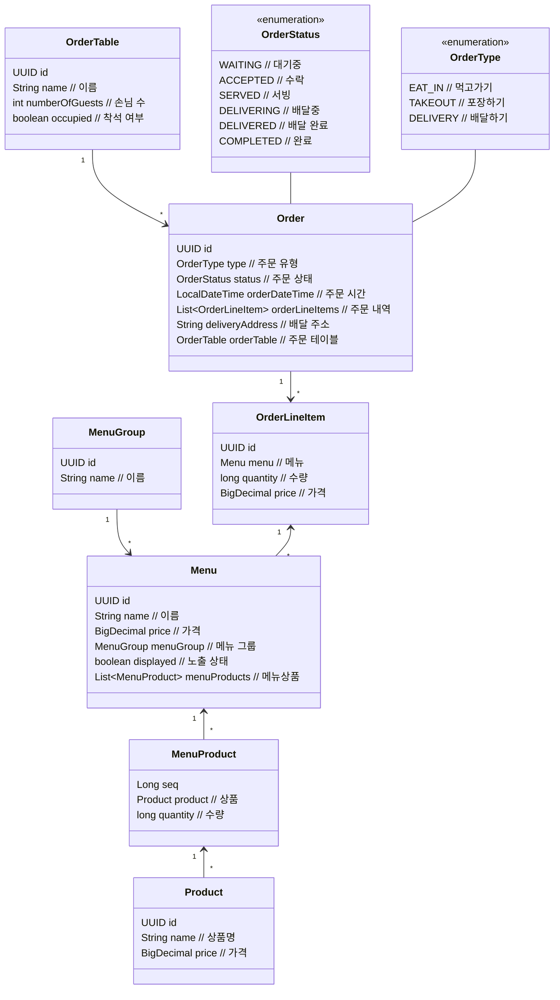

# 키친포스

## 퀵 스타트

```sh
cd docker
docker compose -p kitchenpos up -d
```

## 요구 사항

### 상품

- 상품을 등록할 수 있다.
- 상품의 가격이 올바르지 않으면 등록할 수 없다.
    - 상품의 가격은 0원 이상이어야 한다.
- 상품의 이름이 올바르지 않으면 등록할 수 없다.
    - 상품의 이름에는 비속어가 포함될 수 없다.
- 상품의 가격을 변경할 수 있다.
- 상품의 가격이 올바르지 않으면 변경할 수 없다.
    - 상품의 가격은 0원 이상이어야 한다.
- 상품의 가격이 변경될 때 메뉴의 가격이 메뉴에 속한 상품 금액의 합보다 크면 메뉴가 숨겨진다.
- 상품의 목록을 조회할 수 있다.

### 메뉴 그룹

- 메뉴 그룹을 등록할 수 있다.
- 메뉴 그룹의 이름이 올바르지 않으면 등록할 수 없다.
    - 메뉴 그룹의 이름은 비워 둘 수 없다.
- 메뉴 그룹의 목록을 조회할 수 있다.

### 메뉴

- 1 개 이상의 등록된 상품으로 메뉴를 등록할 수 있다.
- 상품이 없으면 등록할 수 없다.
- 메뉴에 속한 상품의 수량은 0 이상이어야 한다.
- 메뉴의 가격이 올바르지 않으면 등록할 수 없다.
    - 메뉴의 가격은 0원 이상이어야 한다.
- 메뉴에 속한 상품 금액의 합은 메뉴의 가격보다 크거나 같아야 한다.
- 메뉴는 특정 메뉴 그룹에 속해야 한다.
- 메뉴의 이름이 올바르지 않으면 등록할 수 없다.
    - 메뉴의 이름에는 비속어가 포함될 수 없다.
- 메뉴의 가격을 변경할 수 있다.
- 메뉴의 가격이 올바르지 않으면 변경할 수 없다.
    - 메뉴의 가격은 0원 이상이어야 한다.
- 메뉴에 속한 상품 금액의 합은 메뉴의 가격보다 크거나 같아야 한다.
- 메뉴를 노출할 수 있다.
- 메뉴의 가격이 메뉴에 속한 상품 금액의 합보다 높을 경우 메뉴를 노출할 수 없다.
- 메뉴를 숨길 수 있다.
- 메뉴의 목록을 조회할 수 있다.

### 주문 테이블

- 주문 테이블을 등록할 수 있다.
- 주문 테이블의 이름이 올바르지 않으면 등록할 수 없다.
    - 주문 테이블의 이름은 비워 둘 수 없다.
- 빈 테이블을 해지할 수 있다.
- 빈 테이블로 설정할 수 있다.
- 완료되지 않은 주문이 있는 주문 테이블은 빈 테이블로 설정할 수 없다.
- 방문한 손님 수를 변경할 수 있다.
- 방문한 손님 수가 올바르지 않으면 변경할 수 없다.
    - 방문한 손님 수는 0 이상이어야 한다.
- 빈 테이블은 방문한 손님 수를 변경할 수 없다.
- 주문 테이블의 목록을 조회할 수 있다.

### 주문

- 1개 이상의 등록된 메뉴로 배달 주문을 등록할 수 있다.
- 1개 이상의 등록된 메뉴로 포장 주문을 등록할 수 있다.
- 1개 이상의 등록된 메뉴로 매장 주문을 등록할 수 있다.
- 주문 유형이 올바르지 않으면 등록할 수 없다.
- 메뉴가 없으면 등록할 수 없다.
- 매장 주문은 주문 항목의 수량이 0 미만일 수 있다.
- 매장 주문을 제외한 주문의 경우 주문 항목의 수량은 0 이상이어야 한다.
- 배달 주소가 올바르지 않으면 배달 주문을 등록할 수 없다.
    - 배달 주소는 비워 둘 수 없다.
- 빈 테이블에는 매장 주문을 등록할 수 없다.
- 숨겨진 메뉴는 주문할 수 없다.
- 주문한 메뉴의 가격은 실제 메뉴 가격과 일치해야 한다.
- 주문을 접수한다.
- 접수 대기 중인 주문만 접수할 수 있다.
- 배달 주문을 접수되면 배달 대행사를 호출한다.
- 주문을 서빙한다.
- 접수된 주문만 서빙할 수 있다.
- 주문을 배달한다.
- 배달 주문만 배달할 수 있다.
- 서빙된 주문만 배달할 수 있다.
- 주문을 배달 완료한다.
- 배달 중인 주문만 배달 완료할 수 있다.
- 주문을 완료한다.
- 배달 주문의 경우 배달 완료된 주문만 완료할 수 있다.
- 포장 및 매장 주문의 경우 서빙된 주문만 완료할 수 있다.
- 주문 테이블의 모든 매장 주문이 완료되면 빈 테이블로 설정한다.
- 완료되지 않은 매장 주문이 있는 주문 테이블은 빈 테이블로 설정하지 않는다.
- 주문 목록을 조회할 수 있다.

## 용어 사전

### 공통

#### Actor(주체)

| 한글명  | 영문명         | 설명                     |
|------|-------------|------------------------|
| 사장님  | owner       | 손님에게 메뉴를 판매하는 사용자      |
| 손님   | guest       | 사장님이 제공하는 메뉴를 구매하는 사용자 |
| 매장   | restaurant  | 매장 주문한 손님이 메뉴를 제공받는 장소 |
| 키친포스 | kitchen pos | 매장에서 주문을 처리하고 관리하는 시스템 |

### 상품

#### 단어

| 한글명   | 영문명           | 설명                                          |
|-------|---------------|---------------------------------------------|
| 상품    | product       | 메뉴를 구성하는 최소 단위                              |
| 상품명   | product name  | 상품의 이름                                      |
| 상품 가격 | product price | 상품의 가격                                      |
| 비속어   | profanity     | 저급하고 거친 표현으로, 다른 사용자에게 불쾌감을 주기에 사용할 수 없는 단어 |

#### 행위

| 한글명  | 영문명    | 설명               |
|------|--------|------------------|
| 등록한다 | create | 상품에 대한 정보를 등록한다. |
| 변경한다 | change | 상품에 대한 정보를 변경한다. |
| 조회한다 | find   | 상품에 대한 정보를 조회한다. |

### 메뉴

#### 단어

| 한글명    | 영문명              | 설명                                          |
|--------|------------------|---------------------------------------------|
| 메뉴     | menu             | 손님이 주문을 할 수 있는 단위                           |
| 메뉴 이름  | menu name        | 메뉴의 이름                                      |
| 메뉴 가격  | menu price       | 메뉴의 가격                                      |
| 노출 상태  | display status   | 메뉴가 손님에게 보여지는지 여부                           |
| 노출된 메뉴 | displayed menu   | (노출 상태)손님이 메뉴를 볼수 있는 상태                     |
| 숨긴 메뉴  | hidden menu      | (노출 상태)손님이 메뉴를 볼수 없는 상태                     |
| 비속어    | profanity        | 저급하고 거친 표현으로, 다른 사용자에게 불쾌감을 주기에 사용할 수 없는 단어 |
| 메뉴 상품  | menu product     | 특정 메뉴에 포함된 상품                               |
| 상품 수량  | product quantity | 특정 메뉴에 포함된 각각의 상품의 수량                       |

#### 행위

| 한글명   | 영문명     | 설명               |
|-------|---------|------------------|
| 등록한다  | create  | 메뉴에 대한 정보를 등록한다. |
| 변경한다  | change  | 메뉴에 대한 정보를 변경한다. |
| 조회한다  | find    | 메뉴에 대한 정보를 조회한다. |
| 노출한다  | display | 메뉴를 노출한다.        |
| 미노출한다 | hide    | 메뉴를 미노출한다.       |

### 메뉴 그룹

#### 단어

| 한글명      | 영문명             | 설명        |
|----------|-----------------|-----------|
| 메뉴 그룹    | menu group      | 메뉴가 속한 그룹 |
| 메뉴 그룹 이름 | menu group name | 메뉴그룹의 이름  |

#### 행위

| 한글명  | 영문명    | 설명                 |
|------|--------|--------------------|
| 등록한다 | create | 메뉴그룹에 대한 정보를 등록한다. |
| 조회한다 | find   | 메뉴그룹에 대한 정보를 조회한다. |

### 주문 테이블

#### 단어

| 한글명       | 영문명               | 설명                        |
|-----------|-------------------|---------------------------|
| 주문 테이블    | order table       | 손님이 매장 내에서 메뉴를 제공받는 테이블   |
| 주문 테이블 이름 | order table name  | 주문 테이블 이름                 |
| 손님 수      | number of guest   | 손님이 매장 내에서 메뉴를 제공받는 테이블   |
| 착석 상태     | occupation status | 주문 테이블의 착석 여부             |
| 착석        | occupied          | (착석 상태)손님이 주문 테이블에 착석한 상태 |
| 미착석       | unoccupied        | (착석 상태)주문 테이블이 비어있는 상태    |

#### 행위

| 한글명   | 영문명    | 설명                   |
|-------|--------|----------------------|
| 등록한다  | create | 주문 테이블에 대한 정보를 등록한다. |
| 변경한다  | change | 주문 테이블에 대한 정보를 변경한다. |
| 조회한다  | find   | 주문 테이블에 대한 정보를 조회한다. |
| 착석한다. | sit    | 손님이 주문 테이블에 착석한다.    |
| 치운다.  | clear  | 주문 테이블을 치운다.         |

### 주문

#### 단어

| 한글명      | 영문명                      | 설명                                  |
|----------|--------------------------|-------------------------------------|
| 주문       | order                    | 손님이 메뉴를 구매 신청한 것                    |
| 주문 금액    | order price              | 주문 내역의 총 금액                         |
| 주문 시간    | order date time          | 손님이 주문한 시간                          |
| 주문 유형    | order type               | 주문의 유형                              |
| 주문 상태    | order status             | 주문의 상태                              |
| 대기중      | waiting                  | (주문 상태)주문 등록 후 접수 대기 상태             |
| 접수       | accepted                 | (주문 상태)사장님이 주문을 수락한 상태              |
| 주문완료     | completed                | (주문 상태)주문이 완료됐을때의 상태                |
| 주문 내역    | order line item          | 손님이 주문한 메뉴의 정보                      |
| 주문 내역 수량 | order line item quantity | 손님이 주문한 메뉴의 수량                      |
| 주문 내역 가격 | order line item price    | 손님이 주문한 주문내역의 가격 (계산식: 메뉴가격 x 주문수량) |

#### 행위

| 한글명  | 영문명    | 설명             |
|------|--------|----------------|
| 주문한다 | order  | 손님이 메뉴를 주문한다.  |
| 수락한다 | accept | 사장님이 주문을 수락하다. |

### 매장 내 먹기 주문

#### 단어

| 한글명     | 영문명    | 설명                          |
|---------|--------|-----------------------------|
| 매장에서 먹기 | eat in | (주문 유형)손님이 매장에서 메뉴를 제공받는 주문 |
| 서빙      | served | (주문 상태)메뉴가 손님에게 전달한 상태      |

### 포장 주문

#### 단어

| 한글명 | 영문명     | 설명                              |
|-----|---------|---------------------------------|
| 포장  | takeout | (주문 유형)손님이 매장에 방문해서 메뉴를 가져가는 주문 |
| 서빙  | served  | (주문 상태)메뉴가 손님에게 전달 가능한 상태       |

### 배달 주문

#### 단어

| 한글명   | 영문명              | 설명                             |
|-------|------------------|--------------------------------|
| 배달    | delivery         | (주문 유형)손님에게 메뉴를 배달 장소로 배달하는 주문 |
| 서빙    | served           | (주문 상태)메뉴가 배닭기사에게 전달 가능한 상태    |
| 배달 주소 | delivery address | 손님이 배달받을 주소                    |
| 배달 기사 | delivery rider   | 손님이 주문한 메뉴를 배달하는 사용자           |
| 배달중   | delivering       | (주문 상태)라이더에게 메뉴를 전달한 상태        |
| 배달완료  | delivered        | (주문 상태)라이더가 배달을 완료 상태          |

#### 행위

| 한글명       | 영문명               | 설명                           |
|-----------|-------------------|------------------------------|
| 배달을 시작한다. | start delivery    | 배달기사가 주문한 메뉴를 가지고 갔다.        |
| 배달을 완료했다. | complete delivery | 배달기사가 주문한 메뉴를 손님에게 전달을 완료했다. |

## 모델링

### 상품(Product)

#### 상태

- 상품명(name)
    - 상품명은 필수값이다.
    - 상품명은 비속어를 포함할 수 없다.
- 가격(price)
    - 가격은 필수값이다.
    - 가격은 0원보다 작을 수 없다.

#### 행위

- 상품을 등록할 수 있다.
    - PurgomalumClient를 통해 비속어 검증을 한다.
- 상품 가격을 변경할 수 있다.
    - 메뉴의 가격이 메뉴에 속한 상품 가격의 합보다 클 경우 메뉴는 숨겨진다.
- 상품을 조회할 수 있다.

### 메뉴 그룹(MenuGroup)

#### 상태

- 이름(name)
    - 메뉴 그룹 이름은 필수값이다.
    - 메뉴 그룹 이름은 비어있을 수 없다.

#### 행위

- 메뉴 그룹을 등록할 수 있다.
- 메뉴 그룹을 조회할 수 있다.

### 메뉴(Menu)

#### 상태

- 이름(name)
    - 상품명은 필수값이다.
    - 상품명은 비속어를 포함할 수 없다.
- 가격(price)
    - 가격은 필수값이다.
    - 가격은 0원 이상이어야 한다.
- 메뉴 그룹(menuGroup)
    - 메뉴 그룹은 필수값이다.
- 노출 상태(displayed)
    - 노출 상태는 필수값이다.
- 메뉴 상품(menuProducts)
    - 메뉴에 속한 상품은 1개 이상이어야 한다.

#### 행위

- 메뉴를 등록할 수 있다.
    - PurgomalumClient를 통해 비속어 검증을 한다.
    - 메뉴에 속한 상품 중에 존재하지 않는 상품이 있으면 등록할 수 없다.
    - 가격은 메뉴 상품 가격의 합보다 작거나 같아야 한다.
- 메뉴 가격을 변경할 수 있다.
    - 가격은 메뉴 상품 가격의 합보다 작거나 같아야 한다.
- 메뉴를 노출할 수 있다.
    - 가격은 메뉴 상품 가격의 합보다 작거나 같아야 한다.
- 메뉴를 미노출할 수 있다.
- 메뉴를 조회할 수 있다.

### 메뉴 상품(MenuProduct)

#### 상태

- 상품(product)
    - 상품은 필수값이다.
- 수량(quantity)
    - 수량은 필수값이다.
    - 수량은 0 보다 커야 한다.

### 주문 테이블(OrderTable)

#### 상태

- 이름(name)
    - 주문 테이블 이름은 필수값이다.
    - 주문 테이블 이름은 비어있을 수 없다.
- 손님 수(numberOfGuests)
    - 손님 수는 0명 이상이어야 한다.
- 착석 여부(occupied)

#### 행위

- 주문 테이블을 등록할 수 있다.
    - 손님 수는 0명으로 설정된다.
    - 착석 여부는 미착석으로 설정된다.
- 주문 테이블에 착석할 수 있다.
    - 존재하지 않는 주문 테이블에 착석할 수 없다.
- 주문 테이블을 치울 수 있다.
    - 존재하지 않는 주문 테이블에 착석할 수 없다.
    - 완료되지 않은 주문이 있는 주문 테이블은 치울 수 없다.
    - 손님 수는 0명으로 설정된다.
- 주문 테이블의 손님 수를 변경할 수 있다.
    - 존재하지 않는 주문 테이블에 착석할 수 없다.
    - 미착석인 주문 테이블의 손님 수를 변경할 수 없다.
- 주문 테이블을 조회할 수 있다.

### 주문 내역(OrderLineItem)

#### 상태

- 메뉴(menu)
    - 메뉴는 필수값이다.
- 수량(quantity)
    - 수량은 필수값이다.
    - 포장하기와 배달하기의 주문 내역 수량은 0 이상이여야 한다.
- 가격(price)

### 주문(Order)

#### 상태

- 주문 유형(type)
    - 주문 유형은 필수값이다.
- 주문 상태(status)
- 주문 시간(orderDateTime)
- 주문 내역(orderLineItems)
    - 주문 내역은 필수값이다.
    - 주문 내역은 1개 이상이여야 한다.
- 배달 주소(deliveryAddress)
    - 배달하기 주문인 경우에는 핋수값이다.
    - 배달하기 주문인 경우에는 비어있을 수 없다.
- 주문 테이블(orderTable)
    - 먹고가기인 경우 주문 테이블은 필수값이다.

#### 행위

- 주문을 할 수 있다.
    - 존재하지 않는 메뉴는 주문할 수 없다.
    - 먹고가기인 경우 존재하지 않은 주문 테이블에 주문할 수 없다.
    - 포장하기와 배달하기의 주문 내역 수량은 0 이상이여야 한다.
    - 주문 내역의 속해있는 메뉴가 존재하지 않으면 주문할 수 없다.
    - 메뉴가 미노출인 경우 주문할 수 없다.
    - 메뉴 상태는 대기중으로 설정된다.
    - 주문 시간은 현재 시간으로 설정된다.
    - 주문 테이블이 미착석인 경우 주문할 수 없다.
- 주문을 수락할 수 있다.
    - 존재하지 않는 주문은 수락할 수 없다.
    - 주문 상태가 대기중인 주문만 수락할 수 있다.
    - 배달하기 주문인 경우 배달 기사에 배달을 요청할 수 있다.
        - KitchenridersClient를 통해 배달을 요청한다.
    - 주문 상태를 수락으로 변경한다.
- 주문을 서빙할 수 있다.
    - 존재하지 않는 주문은 서빙할 수 없다.
    - 수락된 주문만 서빙할 수 있다.
    - 주문 상태를 서빙으로 변경한다.
- 배달을 시작할 수 있다.
    - 존재하지 않는 주문은 배달할 수 없다.
    - 배달하기 주문이 경우에만 배달할 수 있다.
    - 서빙된 주문만 배달할 수 있다.
    - 주문 상태를 배달중으로 변경한다.
- 배달을 완료할 수 있다.
    - 존재하지 않는 주문은 배달을 완료할 수 없다.
    - 배달중인 주문만 배달할 수 있다.
    - 주문 상태를 배달완료로 변경한다.
- 주문을 완료할 수 있다.
    - 존재하지 않는 주문은 주문을 완료할 수 없다.
    - 배달하기 주문의 경우 배달 완료된 주문만 완료할 수 있다.
    - 포장하기 및 먹고가기 주문의 경우 서빙된 주문만 완료할 수 있다.
    - 주문 상태를 주문완료로 변경한다.
    - 먹고가기 주문인 경우 해당 주문 테이블의 모든 주문이 완료된 경우에만 테이블을 치울 수 있다.
- 주문을 조회할 수 있다.



## 정책

### 배달하기

1. (손님) 배달하기 주문을 한다. - 대기중
2. (사장님) 배달하기 주문을 수락한다. - 수락
3. (사장님) 배달 기사에게 배달을 요청한다.
4. (사장님) 메뉴를 완성하여, 배달 기사가 배달할 수 있도록 메뉴를 놔둔다. - 서빙
5. (배달 기사) 배달을 시작한다. - 배달중
6. (배달 기사) 배달을 완료한다. - 배달완료
7. (사장님) 주문을 완료한다. - 주문완료

### 포장하기

1. (손님) 포장하기 주문을 한다. - 대기중
2. (사장님) 포장하기 주문을 수락한다. - 수락
3. (사장님) 메뉴를 완성하여 손님이 가져갈 수 있도록 메뉴를 놔둔다. - 서빙
4. (사장님) 손님이 메뉴를 가져가고 주문을 완료한다. - 주문완료

### 먹고가기

1. (손님) 비어있는 주문 테이블에 착석한다.
2. (사장님) 주문 테이블의 손님수를 설정한다.
3. (손님) 먹고가기 주문을 한다. - 대기중
4. (사장님) 먹고가기 주문을 수락한다. - 수락
5. (사장님) 메뉴를 완성한다. - 서빙
6. (사장님) 손님에게 메뉴를 직접 가져다 드리고 주문을 완료한다. - 주문완료
7. (사장님) 해당 주문테이블에 모든 주문이 완료되면 주문 테이블을 치운다.

### 메뉴 생성

1. (사장님) 상품을 등록한다.
2. (사장님) 메뉴 그룹을 등록한다.
3. (사장님) 메뉴 상품을 설정한다.
4. (사장님) 메뉴를 등록한다.
